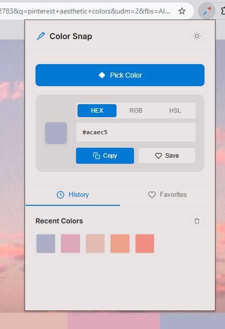
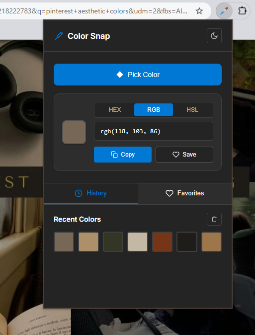

# 🎨 Color Snap

<div align="center">


**A modern, professional Chrome extension for picking and managing colors with ease**

[](https://github.com/yourusername/color-snap)
[](LICENSE)
[](https://github.com/yourusername/color-snap)

[Features](#-features) • [Installation](#-installation) • [Usage](#-usage) • [Screenshots](#-screenshots) • [Contributing](#-contributing)

---

</div>

## ✨ Features

### 🎯 **Core Functionality**
- **Native EyeDropper API** - Precise color picking from any webpage
- **Multiple Color Formats** - Support for HEX, RGB, and HSL formats
- **One-Click Copy** - Instantly copy colors to clipboard
- **Smart History** - Automatically saves your recent color picks
- **Favorites System** - Save and organize your favorite colors

### 🌓 **Modern Design**
- **Dark/Light Mode** - Toggle between themes with smooth transitions
- **Fluent Design** - Microsoft-inspired modern UI
- **Professional Polish** - Clean, minimalistic interface
- **Responsive Layout** - Optimized for all screen sizes
- **Smooth Animations** - Delightful micro-interactions

### 💾 **Data Management**
- **Persistent Storage** - All data saved locally using Chrome Storage API
- **History Management** - View and manage up to 20 recent colors
- **Favorites Collection** - Organize up to 20 favorite colors
- **Easy Cleanup** - Clear history and favorites with one click

## 🚀 Installation

### Option 1: Chrome Web Store (Not Released Yet)
1. Visit the [Chrome Web Store page](https://chrome.google.com/webstore) *(Coming Soon)*
2. Click "Add to Chrome"
3. Confirm the installation
4. Start picking colors!

### Option 2: Manual Installation (Developer Mode)
1. **Download** the extension files:
   ```bash
   git clone https://github.com/LikhithSP/color-snap.git
   cd color-snap
   ```

2. **Open Chrome Extensions**:
   - Navigate to `chrome://extensions/`
   - Enable "Developer mode" (top-right toggle)

3. **Load the extension**:
   - Click "Load unpacked"
   - Select the extension folder
   - The Color Snap icon will appear in your toolbar

## 📱 Usage

### Basic Color Picking
1. **Click** the Color Snap icon in your Chrome toolbar
2. **Select** "Pick Color" button
3. **Click** anywhere on the webpage to capture the color
4. **Copy** the color value or save it to favorites

### Format Switching
- Use the **HEX/RGB/HSL** tabs to switch between color formats
- The extension remembers your preferred format

### Managing Colors
- **History Tab**: View and reuse recently picked colors
- **Favorites Tab**: Access your saved favorite colors
- **Remove Colors**: Hover over any color and click the × button
- **Clear All**: Use the trash icon to clear entire collections

### Theme Toggle
- Click the **sun/moon icon** in the header to switch themes
- Your theme preference is automatically saved

## 📸 Screenshots

<div align="center">

### Light Mode


### Dark Mode  



</div>

## 🛠️ Technical Details

### Built With
- **HTML5** - Semantic markup structure
- **CSS3** - Modern styling with custom properties
- **Vanilla JavaScript** - Lightweight, no dependencies
- **Chrome APIs** - EyeDropper API, Storage API, Clipboard API

### Browser Compatibility
- ✅ **Chrome 95+** (EyeDropper API support)
- ✅ **Edge 95+** (Chromium-based)
- ❌ **Firefox** (EyeDropper API not supported)
- ❌ **Safari** (EyeDropper API not supported)

### File Structure
```
color-snap/
├── manifest.json          # Extension configuration
├── popup.html            # Main popup interface
├── popup.css             # Styling and themes
├── popup.js              # Core functionality
├── color.png             # Extension icon
└── README.md             # This file
```

## 🎨 Design System

### Color Palette
- **Primary**: `#0078d4` (Microsoft Blue)
- **Secondary**: `#106ebe` (Darker Blue)
- **Success**: `#4caf50` (Green)
- **Light Theme**: Various grays and whites
- **Dark Theme**: Dark grays and whites

### Typography
- **Font Family**: Inter (with system fallbacks)
- **Weights**: 300, 400, 500, 600, 700

## 🔧 Development

### Prerequisites
- Chrome browser (95+)
- Basic knowledge of HTML, CSS, JavaScript

### Local Development
1. Clone the repository
2. Make your changes
3. Load the extension in Chrome (Developer mode)
4. Test your changes
5. Submit a pull request

### Building for Production
No build process required - the extension runs directly from source files.

## 🤝 Contributing

We welcome contributions! Here's how you can help:

### Ways to Contribute
- 🐛 **Report bugs** - Found an issue? Let us know!
- 💡 **Suggest features** - Have ideas for improvements?
- 📝 **Improve documentation** - Help make the docs clearer
- 🎨 **Design improvements** - UI/UX enhancements welcome
- 💻 **Code contributions** - Bug fixes and new features

### Development Workflow
1. **Fork** the repository
2. **Create** a feature branch (`git checkout -b feature/amazing-feature`)
3. **Commit** your changes (`git commit -m 'Add amazing feature'`)
4. **Push** to the branch (`git push origin feature/amazing-feature`)
5. **Open** a Pull Request

## 📄 License

This project is licensed under the MIT License - see the [LICENSE](LICENSE) file for details.

## 🙏 Acknowledgments

- **Microsoft Fluent Design** - Design inspiration
- **Feather Icons** - SVG icon set
- **Chrome EyeDropper API** - Native color picking functionality
- **Inter Font** - Beautiful typography

---

<div align="center">

**Made with ❤️ by Likith SP (https://github.com/LikhithSP)

[⭐ Star this repo](https://github.com/yourusername/color-snap) • [🐛 Report Bug](https://github.com/yourusername/color-snap/issues) • [💡 Request Feature](https://github.com/yourusername/color-snap/issues)

</div>
